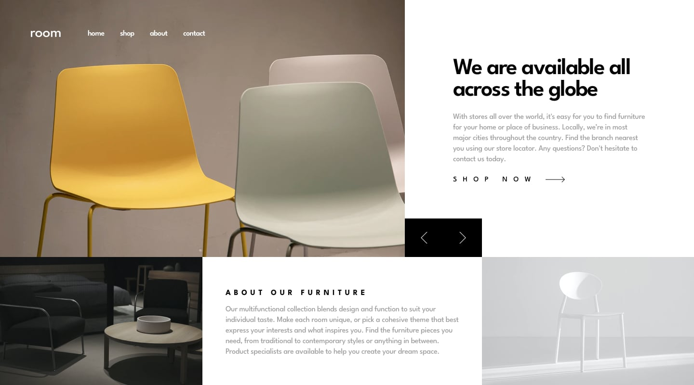

# Frontend Mentor - Todo app

# Desktop

## slide #:
1 | 2 | 3
--- | --- | ---
 |  | 

## sctive-states: 

## Mobile

1 | 2
--- | ---
 |  

## Welcome! 👋

### Links

-   Solution URL: [here]()
-   Live Site URL: [here](https://room-homepage-master-woad.vercel.app/)

### Built with

-   REACT 18
-   REACT HOOKS
-   SASS MODULES(DART)
-   WEBPACK 5
-   Mobile-first workflow
